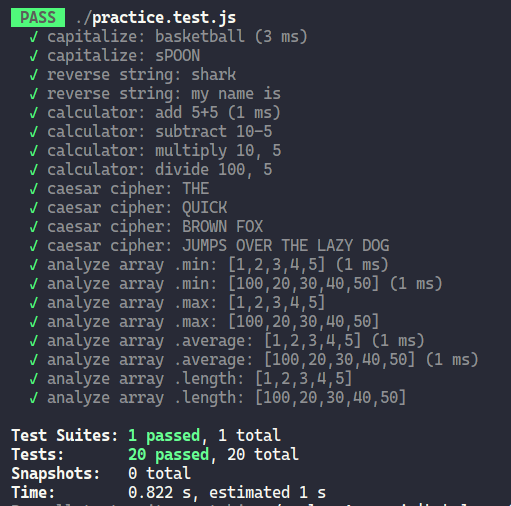

# Odin Project #17: Testing Practice

Welcome to Bryan Miller's Testing Practice Project, the [seventeenth assignment](https://www.theodinproject.com/lessons/node-path-javascript-testing-practice) within the Odin Project curriculum. The goal of this repo is to practice the following skill sets:

- Vanilla JavaScript
- Test Driven Development
- Jest
- NPM
- Babel

## Summary

Not much to say about this one other than it was quick and fun. The benefits of test driven development are undeniable and I'm excited to take advantage of them in the next project.

## Screenshots



## Links

- [My Odin Project Progress](https://github.com/bmilcs/odin-project)

## Deployment

```sh
# clone repo
git clone https://github.com/bmilcs/odin-testing-practice

# install dependencies
npm install --save-dev babel-jest @babel/core @babel/preset-env
```
